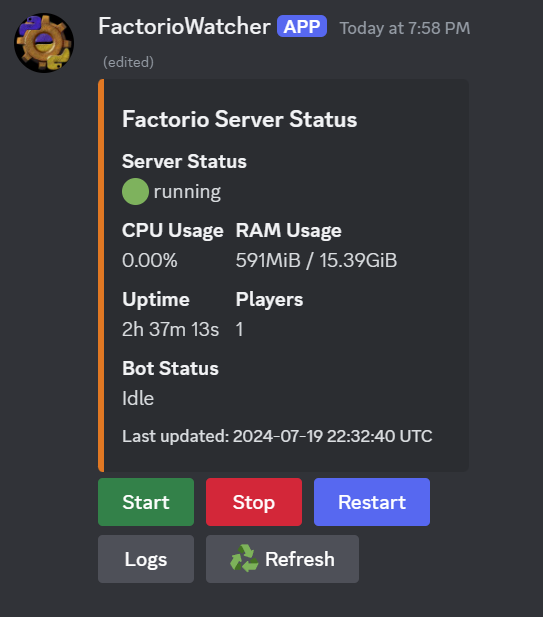

# Factorio Discord Bot

This Discord bot monitors and manages a Factorio server running in a Docker container. It provides real-time status updates, server management commands, and log viewing capabilities through Discord.

## Features

- Real-time server status updates:
  - CPU usage (of the Factorio Docker container)
  - RAM usage (of the Factorio Docker container)
  - Uptime
  - Player count
- Start, stop, and restart the Factorio server
- View server logs
- Automatic status updates at configurable intervals
- Manual status refresh

## Resource Monitoring

The CPU and RAM usage reported by this bot reflect the resources used by the Factorio Docker container, not the entire host system. This provides a focused view of the Factorio server's performance within its allocated resources.



## Prerequisites

- Docker and Docker Compose
- Python 3.9 or higher
- A Discord bot token
- A Factorio server running in a Docker container (using factoriotools/factorio-docker image)

## Setup

1. Clone this repository:
   ```
   git clone https://github.com/yourusername/factorio-discord-bot.git
   cd factorio-discord-bot
   ```

2. Create a `.env` file in the project root with the following content:
   ```
   DISCORD_TOKEN=your_discord_bot_token
   STATUS_CHANNEL_ID=your_status_channel_id
   UPDATE_INTERVAL=60
   LOG_LEVEL=INFO
   FACTORIO_RCON_PASSWORD=your_rcon_password
   FACTORIO_RCON_PORT=27015
   FACTORIO_HOST=localhost
   ```
   Replace the placeholder values with your actual configuration.

3. Ensure your Factorio server container is named `factorio` for the bot to interact with it correctly.

4. Make sure the RCON password in your `.env` file matches the one set in your Factorio server configuration.

5. Build the Docker image for the bot:
   ```
   docker-compose build
   ```

6. Start the bot:
   ```
   docker-compose up -d
   ```

7. To stop the bot:
   ```
   docker-compose down
   ```

8. If you make changes to the code or Dockerfile, rebuild and restart the bot:
   ```
   docker-compose down
   docker-compose build
   docker-compose up -d
   ```

## Discord Bot Permissions

Your Discord bot needs the following permissions:

- Read Messages/View Channels
- Send Messages
- Embed Links
- Attach Files
- Read Message History
- Add Reactions
- Use External Emojis
- Manage Messages (for clearing the status channel)

You can generate an invite link with these permissions using the Discord Developer Portal.

## RCON Setup for Factorio

1. Ensure that RCON is enabled in your Factorio server configuration.

2. Set the RCON password in your Factorio server configuration to match the `FACTORIO_RCON_PASSWORD` in your `.env` file.

3. Make sure the RCON port in your Factorio server configuration matches the `FACTORIO_RCON_PORT` in your `.env` file (default is 27015).

## Usage

Once the bot is running, it will automatically post and update the server status in the specified Discord channel. You can use the buttons on the status message to manage the server:

- Start: Start the Factorio server
- Stop: Stop the Factorio server
- Restart: Restart the Factorio server
- Logs: View the recent server logs
- Refresh: Manually refresh the server status

## Troubleshooting

- If the bot can't connect to the Factorio server, check that the RCON password and port in your `.env` file match the Factorio server's configuration.
- Ensure the Discord bot has the necessary permissions in the server and channel.
- Check the bot's logs for any error messages:
  ```
  docker-compose logs factorio-watcher
  ```

## Disclaimer

This project does not contain any human written lines of code.
This was all made and debugged using mainly Claude 3.5 sonnet, gpt4o and a lot
of thoughtful prompting. This took about 3 days to make for a novice.

## Contributing

Contributions are welcome! Please feel free to submit a Pull Request.

## License

This project is licensed under the MIT License - see the [LICENSE](LICENSE) file for details.
